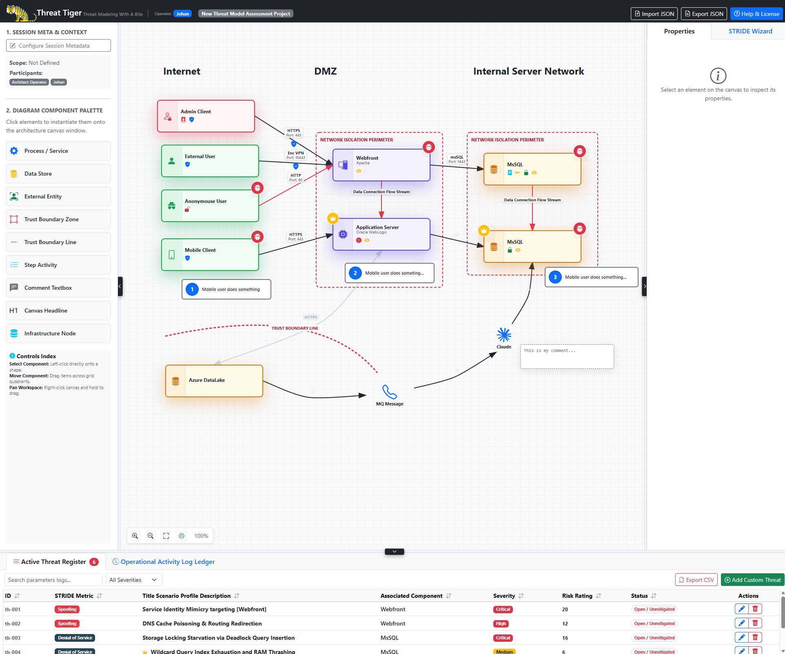

# Threat Tiger 🐯 — Threat Modeling With A Bite

**Threat Tiger** is an interactive, offline-first, client-side threat modeling web application designed to help developers, software architects, and security engineers design, analyze, and secure their system architectures.

Built entirely as a single-page HTML application, Threat Tiger requires no installation, database setup, or internet connection to run. Your architectural data and threat assessments remain entirely local to your machine.

---

## 🚀 Key Features

*   **Interactive Architecture Canvas**: Use a drag-and-drop grid interface to map system designs. Add key components such as Processes, Data Stores, External Entities, Trust Boundaries, Step Activities, Comments, and Infrastructure Nodes.
*   **Dynamic Swimlane Grids**: Group design assets into matrix quadrants using Swimlane components that dynamically resize based on elements placed within them. Headers (row headers / column headers) automatically collapse and hide if all of their respective titles are left empty.
*   **Custom Graphic Imports**: Import your own custom graphic assets or logos directly onto the design canvas. Custom image components support the full range of STRIDE threat template suggestions.
*   **Threat Templates**: Select any canvas component to receive structured threat suggestions categorized by the classic **STRIDE** methodology (Spoofing, Tampering, Repudiation, Information Disclosure, Denial of Service, Elevation of Privilege).
*   **Active Threat Register**: Document and track identified threats directly within the application. Search, filter, and sort threats by category, status, and severity, then write custom description details and mitigation steps.
*   **Operational Activity Log Ledger**: Review a live ledger tracking all session changes, component additions, and threat modifications during your session.
*   **Visual Highlights & Dark Mode Enhancements**: Selected components (including swimlanes, infrastructure nodes, and custom images) feature a distinct blue outline and selection glow. In Dark Mode, the threat bug badge is rendered with high-visibility bright red background elements.
*   **Import / Export JSON**: Save your work at any time. Threat Tiger supports importing and exporting full project configurations (canvas state + threat registers) in JSON format.
*   **Print-Friendly Layout**: Print your diagrams and active threat registers directly to PDF or paper using standard browser print utilities.

---

## 🛠️ How to Get Started

1.  Download or clone this repository.
2.  Open [threat-tiger.html](file:///threat-tiger.html) in any modern web browser (Chrome, Firefox, Edge, Safari).
3.  Configure your **Session Meta & Context** (Scope, Participants, and Operator name).
4.  Drag components from the **Diagram Component Palette** onto the canvas, wire them together with data flows, and inspect their properties.
5.  Use the **Threat Templates** on selected components to identify security risks and append them to your **Active Threat Register**.

---

## 🛠️ Docker

1.  download the docker file
2.  run: sudo docker build -t threat-tiger . && docker run -d --name threat-tiger -p 8080:80 threat-tiger
3.  navigate to: http://localhost:8080/threat-tiger.html

---

## 💻 Tech Stack

*   **HTML5 & SVG** for rendering the interactive canvas and shapes.
*   **CSS & Bootstrap 5** for modern responsive layout grids and components.
*   **Vanilla JavaScript** for all diagram state management, threat calculations, and JSON export/import utilities.

---

## 🤝 Feedback & Support

For bug reports, feature requests, or general feedback, you can:
*   Visit the project's GitHub page: [https://github.com/jozeta/threat-tiger](https://github.com/jozeta/threat-tiger)
*   Contact the developer via email: [johan.zetterstrom@protonmail.com](mailto:johan.zetterstrom@protonmail.com)

---

## 📄 License

This project is licensed under the MIT License. See [threat-tiger.html](file:///threat-tiger.html) for full license details.
